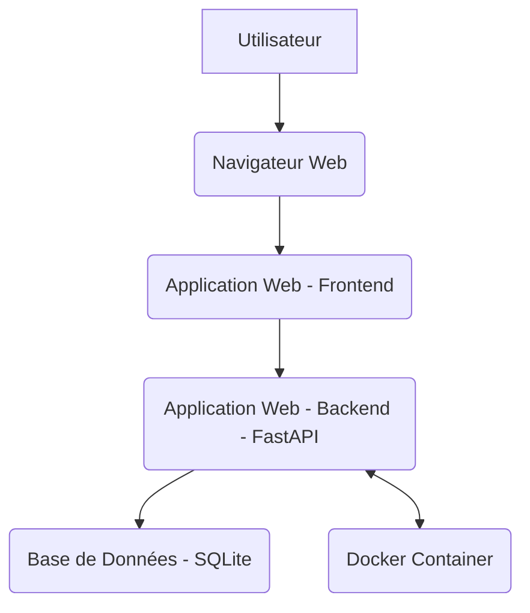

# Architecture Proposition - Budget App

## 1. Vue d'ensemble
L'application sera une application web légère et sécurisée, utilisant Docker pour le déploiement et SQLite pour le stockage des données.

## 2. Composants techniques
*   **Backend :** FastAPI (Python) pour sa modernité et ses performances.
*   **Frontend :** Vue.js (via CDN ou Vite) pour sa légèreté et sa facilité d'intégration avec FastAPI.
*   **Base de données :** SQLite pour sa légèreté et sa facilité d'intégration, adaptée pour une application personnelle.
*   **Conteneurisation :** Docker pour l'isolation de l'environnement et la portabilité du déploiement.

## 3. Diagramme d'architecture (Conceptuel)

## 4. Considérations de sécurité
*   **Authentification :** Gestion des utilisateurs par mot de passe (à implémenter).
*   **Accès à la base de données :** Accès sécurisé via le backend de l'application.

## 5. Synchronisation
La synchronisation en temps réel sera gérée par le backend de l'application, potentiellement via des WebSockets, pour pousser les mises à jour aux clients connectés.
